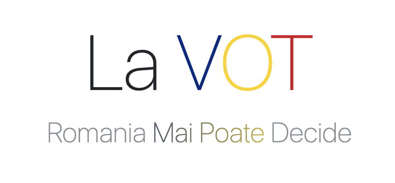

<p align="center">
    <a href="https://lavot.mihaiconstantin.com">
        
    </a>
</p>

<!-- badges: start -->
<p align="center">
    <a href="https://www.repostatus.org/#active"></a>
    <a href="https://github.com/mihaiconstantin/lavot/releases"></a>
    <a href="https://lavot.mihaiconstantin.com"></a>
</p>
<!-- badges: end -->

**La VOT** is a [`React`](https://react.dev/) app (i.e., technological pun
intended) where you can redistribute votes from the first round of the 2024
Romanian presidential elections to the candidates who made it to the second
round. The stakes are high, and the price? Democracy. Our hope is that this app
will inspire at least one person to go out and vote.

## Installation

```bash
# Clone the repository.
git clone https://github.com/mihaiconstantin/lavot.git

# Change directory.
cd lavot

# Install dependencies.
pnpm install

# Start the development server.
pnpm dev
```

## Contributing
- Any contributions are welcome and greatly appreciated. Please open a [pull
  request](https://github.com/mihaiconstantin/lavot/pulls) on `GitHub`.
- To report bugs, or request new features, please open an
  [issue](https://github.com/mihaiconstantin/lavot/issues) on `GitHub`.

## License
- The package source code in this repository is licensed under the [MIT
  license](https://opensource.org/license/mit).
- <p class="license-cc" xmlns:cc="https://creativecommons.org/ns#" xmlns:dct="https://purl.org/dc/terms/"><a property="dct:title" rel="cc:attributionURL" href="https://lavot.mihaiconstantin.com">Other website materials</a> by <a rel="cc:attributionURL dct:creator" property="cc:attributionName" href="https://mihaiconstantin.com">Mihai Constantin</a> and <a rel="cc:attributionURL dct:creator" property="cc:attributionName" href="mailto:ionut.badea@yazee.me">Ionuț Badea</a> are licensed under <a href="https://creativecommons.org/licenses/by/4.0/?ref=chooser-v1" target="_blank" rel="license noopener noreferrer" style="display:inline-block;">CC BY 4.0  </a>.</p>
